---
# You can also start simply with 'default'
theme: seriph
# random image from a curated Unsplash collection by Anthony
# like them? see https://unsplash.com/collections/94734566/slidev
background: https://cover.sli.dev
# some information about your slides (markdown enabled)
title: Akamai to Cloudfare Migration
info: |
  ## Slidev Starter Template
  Akamai to Cloudfare Journey.

  Learn more at [Sli.dev](https://sli.dev)
# apply unocss classes to the current slide
class: text-center
# https://sli.dev/features/drawing
drawings:
  persist: false
# slide transition: https://sli.dev/guide/animations.html#slide-transitions
transition: slide-left
# enable MDC Syntax: https://sli.dev/features/mdc
mdc: true
# open graph
# seoMeta:
#  ogImage: https://cover.sli.dev
---

# Akamai to Cloudfare Migration

Sibendu Das

<div @click="$slidev.nav.next" class="mt-12 py-1" hover:bg="white op-10">
  <carbon:arrow-right />
</div>

<div class="abs-br m-6 text-xl">
  <button @click="$slidev.nav.openInEditor()" title="Open in Editor" class="slidev-icon-btn">
    <carbon:edit />
  </button>
  <a href="https://github.com/sibendu" target="_blank" class="slidev-icon-btn">
    <carbon:logo-github />
  </a>
</div>

<!--
The last comment block of each slide will be treated as slide notes. It will be visible and editable in Presenter Mode along with the slide. [Read more in the docs](https://sli.dev/guide/syntax.html#notes)
-->

---
transition: fade-out
---


# Table of contents

Agenda today:

<Toc text-sm minDepth="1" maxDepth="2" />

---
transition: fade-out
---


# The migration - a 3-step process

```mermaid {scale: 0.4, alt: 'A simple sequence diagram'}
flowchart TD
    Start([🚀 Migration Start]) --> Stage1
    
    subgraph Stage1 ["🔍 <b>Stage 1</b>: Export Configurations - Akamai Property Manager / API/ Terraform"]
        direction LR
        A1([🔧Edge Rules & Behaviors]) --> A2([🛡️Security Policies, WAF Rules])
        A2 --> A3([ 🌐 DNS Configurations, Zone Files])
        A3 --> A4([ 📈 Performance Settings<br/>Export Optimization Rules])
        A4 --> Export([📦 Configuration Export Complete])
    end
    
    subgraph Stage2 ["🔄 Stage 2: Map & Transform"]
        direction TB
        B1[🗺️ Akamai → Cloudflare Configuration Mapping] --> B2[⚙️ Rule Transformation]
        B2 --> B3[🔍 Compatibility Analysis, Feature Validation]
        B3 --> Transform[📝✅ Generate Terraform HCL]
    end
    
    subgraph Stage3 ["☁️ Stage 3: Import & Configure"]
        direction TB
        C1[🏗️ Terraform Plan <br/> 🚀 Terraform Apply] --> C2[🌐 DNS Migration ]
        C2 --> C3[🧪 Testing & Validation]
        C3 --> Deploy[📊 Performance Monitoring, Metrics]
    end
    
    Stage1 --> Stage2
    Stage2 --> Stage3
    Stage3 --> End([✨ Migration Complete])
    
    %% Additional detail boxes
    Export -.-> Details1[📋 Exported Assets:<br/>• Property configurations<br/>• Security rules<br/>• DNS zones<br/>• SSL certificates]
    Transform -.-> Details2[🔧 Terraform Resources:<br/>• cloudflare_zone<br/>• cloudflare_page_rule<br/>• cloudflare_firewall_rule<br/>• cloudflare_record]
    Deploy -.-> Details3[✅ Validation Checks:<br/>• SSL/TLS functionality<br/>• CDN performance<br/>• Security rules<br/>• DNS resolution]
    
    %% Styling
    classDef stageBox fill:#e1f5fe,stroke:#0277bd,stroke-width:1px,color:#000
    classDef akamaiStyle fill:#ff6b6b,stroke:#d63031,stroke-width:2px,color:#fff
    classDef transformStyle fill:#fdcb6e,stroke:#e17055,stroke-width:2px,color:#2d3436
    classDef cloudflareStyle fill:#74b9ff,stroke:#0984e3,stroke-width:2px,color:#fff
    classDef terraformStyle fill:#00b894,stroke:#00a085,stroke-width:3px,color:#fff
    classDef startEndStyle fill:#6c5ce7,stroke:#5f3dc4,stroke-width:2px,color:#fff
    classDef detailStyle fill:#f8f9fa,stroke:#6c757d,stroke-width:1px,color:#495057
    
    class Stage1 stageBox
    class Stage2 stageBox
    class Stage3 stageBox
    class A1,A2,A3,A4,A5,Export akamaiStyle
    class B1,B2,B3,Transform transformStyle
    class B4 terraformStyle
    class C1,C2,Deploy terraformStyle
    class C3,C4,C5 cloudflareStyle
    class Start,End startEndStyle
    class Details1,Details2,Details3 detailStyle
```

<div class="flex w-full">

</div>

---
transition: fade-out
---


# Infrastructure-as-Code with Terraform

- 📝 **Automates infrastructure management** - Eliminates manual cloud resource setup through code-based configuration that works across Akamai, Cloudflare, and other providers
- 🎨 **Reduces deployment risk and time** - Cuts infrastructure provisioning from hours/days to minutes while preventing human errors through automated, consistent deployments
- 🧑‍💻 **Controlled migration process** - Manages both Akamai and Cloudflare configurations simultaneously, allowing phased transitions with rollback capabilities to minimize business disruption
- 🤹 **Team collaboration** - Infrastructure changes are tracked, reviewed, and approved like software code, with full audit trails and version control
- 🎥 **Advanced capabilities** - Like preview, drift .. Teams can see exactly what will change before applying updates, reducing unintended modifications and increasing confidence in deployments

---
transition: slide-up
layout: two-cols-header
---


# Cloudfare : Provisioning Resources with Terraform

With Terraform, configuring resources based on metadata managed in csv (or other formats) is format translation

````md magic-move {lines: true}
```ts {*|1-2}
// Zone record
resource "cloudflare_zone" "cf_zone_mycompany_com" {
  account = {
    id = var.cloudflare_account_id
  }
  name = "mycompany.com"
  type = "full"
}
```

```ts {1-2|3-9}
// DNS Record
resource "cloudflare_dns_record" "cf_dns_mycompany_com_dev_eu-west-1_api_mycompany_com" {
  zone_id = cloudflare_zone.cf_zone_mycompany_com.id
  comment = "*.dev.eu-west-1.api.mycompany.com for cf_zone_mycompany_com"
  content = "www.api.mycompany.com.edgekey.net"
  name    = "*.dev.eu-west-1.api.mycompany.com"
  type    = "CNAME"
  ttl     = 3600
  proxied = false
}
```

````

<v-click>

Once target Cloudfare resources are mapped, we can <span v-mark.red="3">generate Terraform code</span> based on the metadata (managed in csv/ excel). These can be written in <span v-mark.circle.orange="4"><code>Python </code></span>, or any other programming language. 

</v-click>

---


# Use of AI

- 📝 **Code generation for transformation modules** - Once target Cloudfare resource(s) mapped, generate Terraform code. Particularly helpful in managing state of large volume of objects  
- 🎨 **Help establish mapping for complex abstractions** - CDN, WAF involves complex infrastructure constructs. In some cases mapping may not be straight-forward, and AI can assist to derive desired mapping

<br>

<font color=red>But, need to stay aware of pitfalls</font>
<br>
<br>

- 🧭 **Accuracy** - may not offer accurate suggestions for exact target Cloudfare environment 
- 👱 **Must be supervised** - AI recommendations must be supervised with knowledgeable humans to protect from undesired effect, to ensure Reliability, Security


---
layout: image-right
image: github.jpg
---
# GitHub Automation

Fully automatic Cloudflare state management using GitHub workflows

- Automated deployment pipeline
- Pull request validation
- Consistent state and security 
- Compliance and audit trail

<!--
- **Automated deployment pipeline** - trigger Terraform apply/destroy with GitHub Actions 
- **Pull request validation** - Every infrastructure change will be automatically tested
- **Consistent state and security** - Remote state backend (S3/Terraform Cloud) with state locking to prevent concurrent modifications, automated rollback 
- **Compliance and audit trail** - automatically documented in Git history with approval workflows
-->

---
layout: center
class: text-center
---

# Proof-of-Concept

```mermaid {scale: 0.4, alt: 'A simple sequence diagram'}
flowchart LR
    Start([🚀 POC Start]) --> A1[[<b>Akamai Config exported </b>]]
    
    A1 --> C1[🌐 Akamai Configurations Exported ]

    subgraph Migration ["☁️ <b>AI-enabled Migration</b>"]
        C1[🏗️ Create mapping to Cloudfare records <br/>??] --> C2[🌐 AI Processing <br/>?? ]
        C2 --> C3[🧪 <b>Terraform Code </b>]
        C3 --> C4[🌐 <b>GitOps</b> <br/> Git-enabled workflow]
    end
    
    C4 --> C5[[ Cloudfare Configured & Working]]
    
    C5 --> End([✨ POC Complete])
    

    %% Additional detail boxes
    A1 --> Details1[🔧 Property configurations - json & other formats ]
    C3 --> Details2[🔧 cloudflare_zone, cloudflare_firewall_rule, cloudflare_record, ..]
    C5 --> Testing[🔧 <b>Automated Testing</b>: Functional & NFRs]
    
    %% Styling
    classDef stageBox fill:#fdcb6e,stroke:#e17055,stroke-width:2px,color:#2d3436
    classDef akamaiStyle fill:#ff6b6b,stroke:#d63031,stroke-width:2px,color:#fff
    classDef cloudflareStyle fill:#74b9ff,stroke:#0984e3,stroke-width:2px,color:#fff
    classDef terraformStyle fill:#00b894,stroke:#00a085,stroke-width:3px,color:#fff
    classDef startEndStyle fill:#6c5ce7,stroke:#5f3dc4,stroke-width:2px,color:#fff
    classDef detailStyle fill:#f8f9fa,stroke:#6c757d,stroke-width:1px,color:#495057
    
    class Stage3 stageBox
    class A1 akamaiStyle
    class C3,C4 terraformStyle
    class C5 cloudflareStyle
    class Start,End startEndStyle
    class Details1,Details2 detailStyle

    %% Increase font size
    classDef default font-size:24px 
```

<div class="flex w-full" windth="100%" height="100%" valign="top">

</div>


|               <center>1st Iteration</center>        |		     <center>2nd Iteration</center>                |
| --------------------------------------------------- | -----------------------------------------------------------|
| Create simple records - zone                        | Properties configuration  - Create Cloudfare mapping                   |
| Provision with Terraform                            | Provision through Terraform				   |
| Setup Git based workflow foundation                 | - Done - 		                                   |
| Test & Validate                                     | Test & Validate                                            |

---
layout: center
transition: fade-out
---


# Next Steps

· [Cloudfare Dashboard](https://dash.cloudflare.com/8e73955b36f0ccc053e8051b3aa3b19d/home/domains)
· [GitHub Workflow](https://github.com/sibendu/tf.proj.cloudfare/actions) 
· [Cloudfare Terraform Provider](https://registry.terraform.io/providers/cloudflare/cloudflare/latest/docs) 

#### Sibendu
